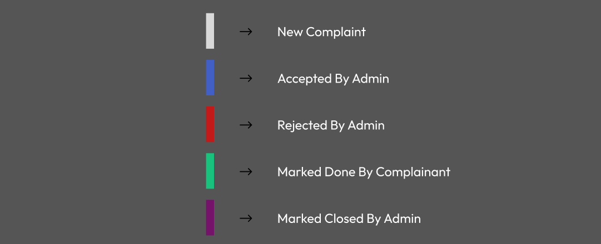
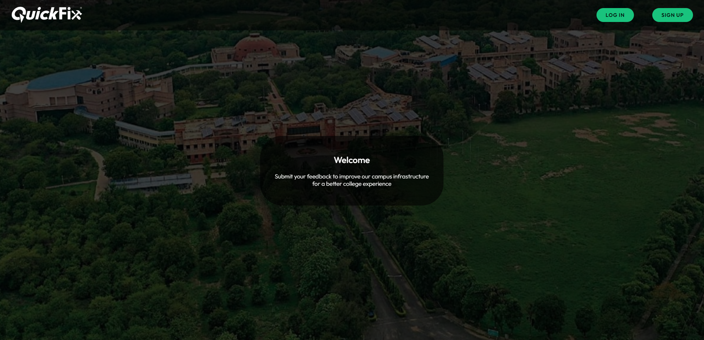
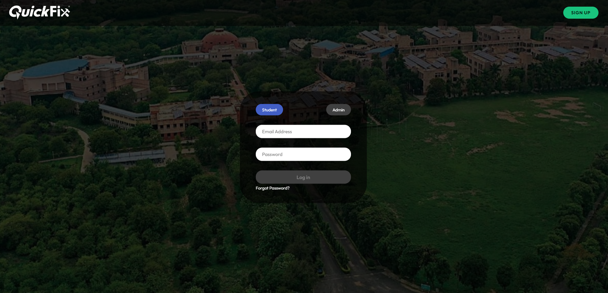
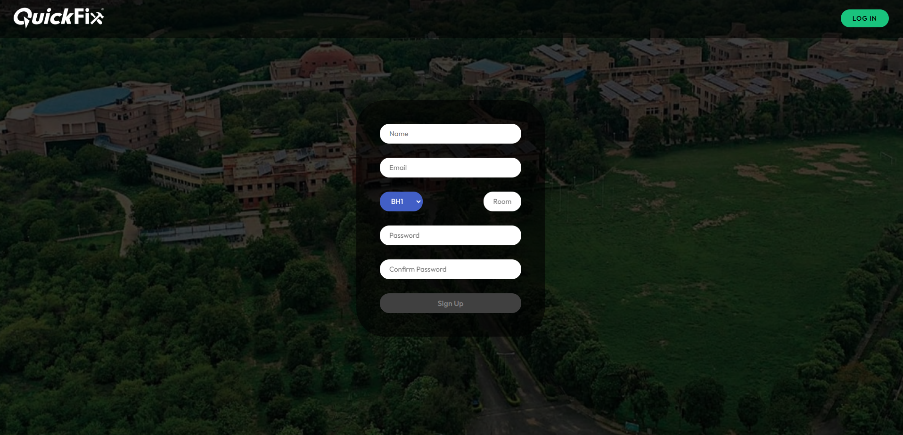
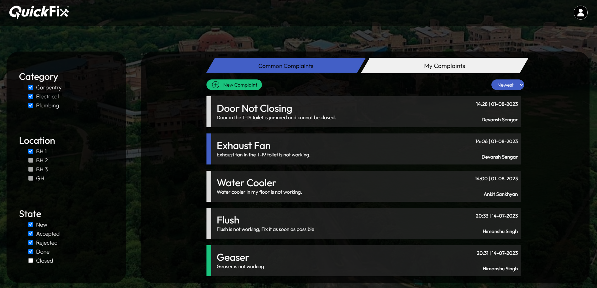
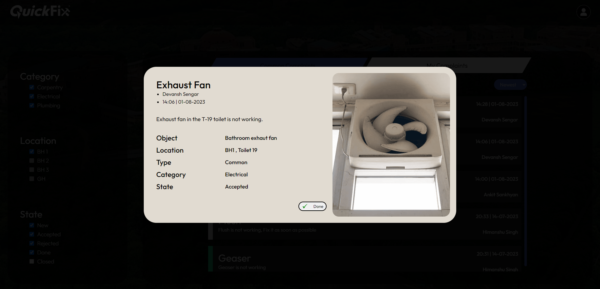
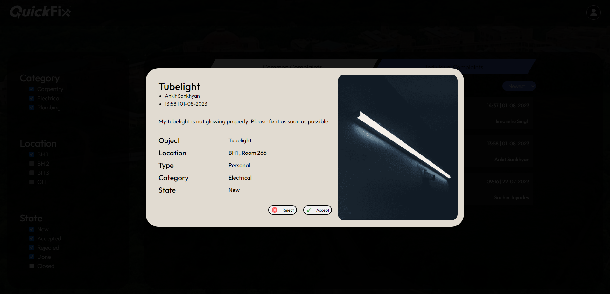
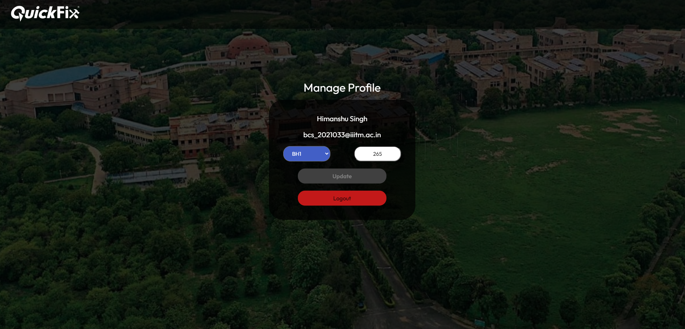

# QuickFix

QuickFix is a user-friendly web-based service designed to digitize and streamline the registration of infrastructure-related complaints within schools and universities. The system allows students to express their complaints regarding infrastructure issues such as electrical, plumbing, and carpentry, and it supports rapid resolution by the college administration.

## Link

[QuickFix](https://statuesque-basbousa-96f8e3.netlify.app/)

Login Credentials (For both student and admin)

**email** : bcs_2021199@iiitm.ac.in  
**password** : 123456

Please note that the backend is hosted on the free tier of Render. So after periods of inactivity, the server may shut down.

When you make a new request after such a period of inactivity, the server needs to restart, which might take around 10-15 seconds. However, once the server is up and running again, subsequent requests will receive instant responses.
## Tech Stack

**Client:** React

**Server:** FastAPI , SQLAlchemy

**Database:** PostgreSQL

**Security:** OAUTH2, JWT, Bcrypt 

**Hosting:** Netlify, Render, Neon

## Features

- User-friendly web interface for students to register complaints.
- Admin panel for administrators to review, accept, and close complaints.
- Categorization of complaints into Carpentry, Plumbing, and Electrical.
- Seamless communication between complainants and administrators.
- Real-time tracking and monitoring of complaint status.

## State Of complaints
QuickFix supports five states of complaints

- **New**: Complaints that are newly registered by students and not yet reviewed by the admin.
- **Accepted**: Complaints that have been reviewed and accepted by the admin for resolution.
- **Rejected**: Complaints that have been reviewed by the admin but are not considered valid or within the platform's scope.
- **Done**: Complaints that have been marked as "Done" by the student, indicating they believe the issue has been resolved.
- **Closed**: Complaints that have been verified and resolved by the admin, signifying the successful resolution of the issue.

## Process Flow

**1. Student Registration**
- Students can sign up using their institute email address, name, hostel, room number, and password.
- A verification email will be sent to the student's institute email for verification.

**2. Login Process (Student / Admin)**
- Students and admins can log in using their institute email and password.

**3. Complaint Registration by Student**
- Students can register new complaints, selecting the complaint type (Personal or Common) and category (Carpentry, Plumbing, or Electrical).
- They can provide a title, description, and optionally, upload a photo related to the complaint.

**4. Deletion of Complaint by the Student**
- Students can delete their registered complaints if needed

**5. Examination of Complaint by the Admin**
- Admins can view common and individual complaints with essential details.
- They can accept or reject complaints based on their validity.

**6. Marking the Complaint Done by the Student**
- Students can mark their accepted complaints as "Done" once they believe the issue is resolved.

**7. Closing the Complaint by the Admin**
- Admins can close the complaint after verification and resolution
## Screenshots
- Home

- Login

- Signup

- Dashboard

- Complaint Popup (Student)

- Complaint Popup (Admin)

- Profile (Student)

